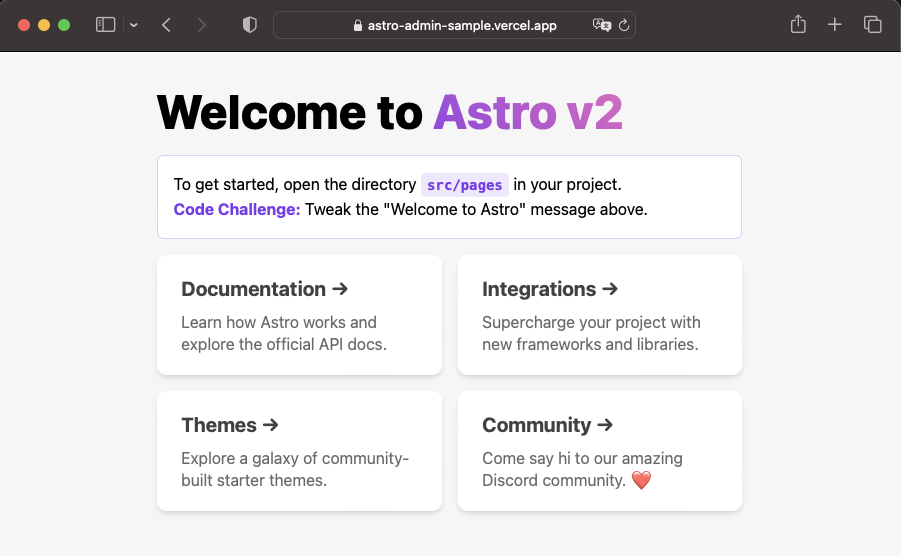

- npx astro add vercel

```
npx astro add vercel
⠋ Resolving packages...(node:6590) ExperimentalWarning: The Fetch API is an experimental feature. This feature could change at any time
(Use `node --trace-warnings ...` to show where the warning was created)
✔ Resolving packages...

  Astro will run the following command:
  If you skip this step, you can always run it yourself later

 ╭────────────────────────────────────────────╮
 │ npm install @astrojs/vercel astro@^2.0.13  │
 ╰────────────────────────────────────────────╯

✔ Continue? … yes
✔ Installing dependencies...

  Astro will make the following changes to your config file:

 ╭ astro.config.mjs ─────────────────────────────────╮
 │ import { defineConfig } from 'astro/config';      │
 │                                                   │
 │ // https://astro.build/config                     │
 │ import vercel from "@astrojs/vercel/serverless";  │
 │                                                   │
 │ // https://astro.build/config                     │
 │ export default defineConfig({                     │
 │   output: "server",                               │
 │   adapter: vercel()                               │
 │ });                                               │
 ╰───────────────────────────────────────────────────╯

  For complete deployment options, visit
  https://docs.astro.build/en/guides/deploy/

✔ Continue? … yes

   success  Added the following integration to your project:
  - @astrojs/vercel
```

- npm install -g vercel

```
npm install -g vercel
npm WARN deprecated sourcemap-codec@1.4.8: Please use @jridgewell/sourcemap-codec instead
npm WARN deprecated rollup-plugin-inject@3.0.2: This package has been deprecated and is no longer maintained. Please use @rollup/plugin-inject.
npm WARN deprecated @npmcli/move-file@1.1.2: This functionality has been moved to @npmcli/fs

added 781 packages, and audited 782 packages in 57s

155 packages are looking for funding
  run `npm fund` for details

found 0 vulnerabilities
```

- vercel

```
vercel
Vercel CLI 24.0.1
? Set up and deploy “~/private/workspace/astro-admin-sample”? [Y/n] y
? Which scope do you want to deploy to? thirosue
? Link to existing project? [y/N] n
? What’s your project’s name? astro-admin-sample
? In which directory is your code located? ./
Auto-detected Project Settings (Astro):
- Build Command: astro build
- Output Directory: dist
- Development Command: astro dev --port $PORT
? Want to override the settings? [y/N] n
🔗  Linked to thirosue/astro-admin-sample (created .vercel and added it to .gitignore)
🔍  Inspect: https://vercel.com/thirosue/astro-admin-sample/23LdqoXfBxRCeh2PsoZj13XGKnY7 [1s]
✅  Production: https://astro-admin-sample.vercel.app [copied to clipboard] [19s]
📝  Deployed to production. Run `vercel --prod` to overwrite later (https://vercel.link/2F).
💡  To change the domain or build command, go to https://vercel.com/thirosue/astro-admin-sample/settings
```

- github integration


- check




https://docs.astro.build/ja/guides/deploy/vercel/
