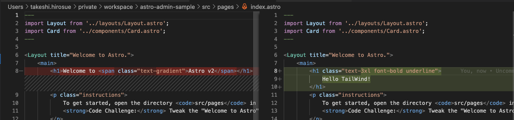
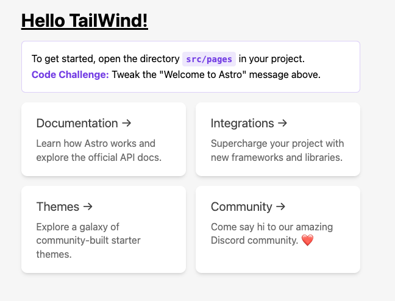

- npx astro add tailwind

```
npx astro add tailwind
⠋ Resolving packages...(node:12595) ExperimentalWarning: The Fetch API is an experimental feature. This feature could change at any time
(Use `node --trace-warnings ...` to show where the warning was created)
✔ Resolving packages...

  Astro will run the following command:
  If you skip this step, you can always run it yourself later

 ╭─────────────────────────────────────────────────────────────────╮
 │ npm install @astrojs/tailwind astro@^2.0.4 tailwindcss@^3.0.24  │
 ╰─────────────────────────────────────────────────────────────────╯

✔ Continue? … yes
✔ Installing dependencies...

  Astro will generate a minimal ./tailwind.config.cjs file.

✔ Continue? … yes

  Astro will make the following changes to your config file:

 ╭ astro.config.mjs ─────────────────────────────────╮
 │ import { defineConfig } from 'astro/config';      │
 │                                                   │
 │ // https://astro.build/config                     │
 │ import vercel from "@astrojs/vercel/serverless";  │
 │                                                   │
 │ // https://astro.build/config                     │
 │ import tailwind from "@astrojs/tailwind";         │
 │                                                   │
 │ // https://astro.build/config                     │
 │ export default defineConfig({                     │
 │   output: "server",                               │
 │   adapter: vercel(),                              │
 │   integrations: [tailwind()]                      │
 │ });                                               │
 ╰───────────────────────────────────────────────────╯

✔ Continue? … yes

   success  Added the following integration to your project:
  - @astrojs/tailwind
```

- check




